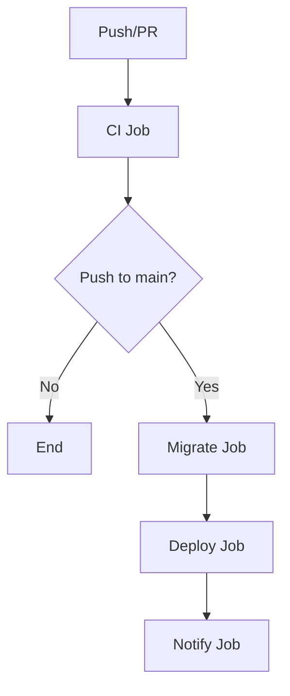

# GitHub Actions Workflows

Modular CI/CD pipeline using reusable workflows for maintainability and code reuse.

## 📁 Workflow Structure

```
.github/workflows/
├── ci-cd.yml                    # Main orchestrator workflow
├── _reusable-setup.yml          # Setup Node.js, pnpm, and caching
├── _reusable-test.yml           # Lint, type check, tests & build
├── _reusable-migrate.yml        # Database migrations
└── _reusable-deploy.yml         # Deploy to Vercel + smoke tests
```

### Why Reusable Workflows?

✅ **Modularity**: Each workflow has a single responsibility
✅ **Reusability**: Share logic across multiple workflows
✅ **Maintainability**: Update in one place, applies everywhere
✅ **Readability**: Main workflow is clean and easy to understand

## 🎯 Main Workflow: `ci-cd.yml`

The orchestrator that calls reusable workflows based on event type.

```yaml
jobs:
  ci:           # Always runs
  migrate:      # Only on main
  deploy:       # Only on main, after migrate
  notify:       # Only on main, always runs
```

### Flow Diagram



## 📦 Reusable Workflows

### `_reusable-setup.yml`

**Purpose:** Sets up Node.js, pnpm, and caching.

**Inputs:**
- `node-version-file` (optional): Path to `.nvmrc` file
- `pnpm-version` (optional): pnpm version to use

**Usage:**
```yaml
jobs:
  setup:
    uses: ./.github/workflows/_reusable-setup.yml
    with:
      node-version-file: '.nvmrc'
      pnpm-version: '9'
```

---

### `_reusable-test.yml`

**Purpose:** Runs lint, type check, tests with coverage, and build.

**Features:**
- Docker setup for testcontainers
- Smart caching (pnpm + node_modules)
- Codecov integration
- Artifact uploads (build + coverage)

**Secrets:**
- `CODECOV_TOKEN` (optional): For coverage reports

**Usage:**
```yaml
jobs:
  test:
    uses: ./.github/workflows/_reusable-test.yml
    secrets:
      CODECOV_TOKEN: ${{ secrets.CODECOV_TOKEN }}
```

---

### `_reusable-migrate.yml`

**Purpose:** Runs database migrations against production database.

**Secrets:**
- `DATABASE_URL` (required): PostgreSQL connection string

**Usage:**
```yaml
jobs:
  migrate:
    uses: ./.github/workflows/_reusable-migrate.yml
    secrets:
      DATABASE_URL: ${{ secrets.DATABASE_URL }}
```

---

### `_reusable-deploy.yml`

**Purpose:** Deploys to Vercel and runs smoke tests.

**Inputs:**
- `environment` (optional): Deployment environment (default: `production`)
- `vercel-args` (optional): Vercel CLI arguments (default: `--prod`)

**Secrets:**
- `VERCEL_TOKEN` (required): Vercel authentication token
- `VERCEL_ORG_ID` (required): Vercel Organization ID
- `VERCEL_PROJECT_ID` (required): Vercel Project ID
- `GITHUB_TOKEN` (optional): For PR comments

**Usage:**
```yaml
jobs:
  deploy:
    uses: ./.github/workflows/_reusable-deploy.yml
    with:
      environment: production
      vercel-args: '--prod'
    secrets:
      VERCEL_TOKEN: ${{ secrets.VERCEL_TOKEN }}
      VERCEL_ORG_ID: ${{ secrets.VERCEL_ORG_ID }}
      VERCEL_PROJECT_ID: ${{ secrets.VERCEL_PROJECT_ID }}
```

## 🔄 Complete Pipeline Flow

### For Pull Requests

```
PR Created/Updated
    ↓
ci-cd.yml triggered
    ↓
CI Job (uses _reusable-test.yml)
    ├─ Lint
    ├─ Type Check
    ├─ Tests + Coverage
    └─ Build
    ↓
✅ PR Ready for Review
```

### For Main Branch (Production)

```
Push to main
    ↓
ci-cd.yml triggered
    ↓
CI Job (uses _reusable-test.yml)
    ├─ Lint
    ├─ Type Check
    ├─ Tests + Coverage
    └─ Build
    ↓
Migrate Job (uses _reusable-migrate.yml)
    └─ Run migrations on Neon
    ↓
Deploy Job (uses _reusable-deploy.yml)
    ├─ Deploy to Vercel
    └─ Smoke tests
    ↓
Notify Job
    └─ Status summary
```

## 🔐 Required Secrets

Configure in: `Settings → Secrets and variables → Actions`

### Mandatory

| Secret | Description | Used By |
|--------|-------------|---------|
| `DATABASE_URL` | PostgreSQL connection URL | `_reusable-migrate.yml` |
| `VERCEL_TOKEN` | Vercel auth token | `_reusable-deploy.yml` |
| `VERCEL_ORG_ID` | Vercel Organization ID | `_reusable-deploy.yml` |
| `VERCEL_PROJECT_ID` | Vercel Project ID | `_reusable-deploy.yml` |

### Optional

| Secret | Description | Used By |
|--------|-------------|---------|
| `CODECOV_TOKEN` | Codecov coverage token | `_reusable-test.yml` |
| `SLACK_WEBHOOK_URL` | Slack notifications | `ci-cd.yml` (notify) |

## 🎯 Vercel Configuration

**IMPORTANT:** Disable auto-deploy to prevent conflicts:

1. Go to: `Vercel Dashboard → Settings → Git`
2. Uncheck: **"Automatic deployments for Production Branch"**
3. Keep enabled: **"Preview deployments"** (for PRs)

## 🛡️ Environment Protection

Optional: Add manual approval before production deployment.

1. Go to: `Settings → Environments → New environment`
2. Name: `production`
3. Configure:
   - ✅ Required reviewers
   - ✅ Wait timer (e.g., 5 minutes)
   - ✅ Deployment branches: only `main`

## 📚 Adding New Reusable Workflows

### Example: Create a new reusable workflow

```yaml
# _reusable-custom.yml
name: Reusable - Custom Job

on:
  workflow_call:
    inputs:
      my-input:
        description: 'Description'
        required: true
        type: string
    secrets:
      MY_SECRET:
        description: 'Secret description'
        required: true

jobs:
  custom:
    name: My Custom Job
    runs-on: ubuntu-latest
    steps:
      - name: Use input
        run: echo "${{ inputs.my-input }}"

      - name: Use secret
        run: echo "Secret: ${{ secrets.MY_SECRET }}"
```

### Call it from main workflow

```yaml
# ci-cd.yml
jobs:
  custom:
    uses: ./.github/workflows/_reusable-custom.yml
    with:
      my-input: 'hello'
    secrets:
      MY_SECRET: ${{ secrets.MY_SECRET }}
```

## ⚡ Performance Tips

### Caching Strategy

All reusable workflows use smart caching:

1. **pnpm store**: Shared across workflows
2. **node_modules**: Restored from cache
3. **Docker layers**: Testcontainer images

**Result:** ~60-70% faster builds with warm cache.

### Concurrency Control

```yaml
concurrency:
  group: ${{ github.workflow }}-${{ github.ref }}
  cancel-in-progress: true
```

- Cancels old workflow runs on new commits
- Saves GitHub Actions minutes
- Faster feedback on PRs

### Conditional Execution

```yaml
if: github.event_name == 'push' && github.ref == 'refs/heads/main'
```

- Migrate and Deploy only run on `main`
- PRs skip expensive production steps

## 🚨 Troubleshooting

### Error: "Workflow must be in .github/workflows"

**Cause:** Reusable workflows must be in the same repository.

**Solution:** Ensure all `_reusable-*.yml` files are in `.github/workflows/`.

---

### Error: "uses requires path to workflow file"

**Cause:** Incorrect path to reusable workflow.

**Solution:** Use relative path from repo root:
```yaml
uses: ./.github/workflows/_reusable-test.yml  # ✅ Correct
uses: _reusable-test.yml                       # ❌ Wrong
```

---

### Error: "Secret not found"

**Cause:** Secret not configured or typo in name.

**Solution:**
1. Check secret name matches exactly (case-sensitive)
2. Verify secret exists in: `Settings → Secrets → Actions`
3. Ensure secret is passed to reusable workflow:
   ```yaml
   secrets:
     DATABASE_URL: ${{ secrets.DATABASE_URL }}
   ```

---

### Workflow doesn't trigger

**Cause:** Event type or branch mismatch.

**Solution:** Check trigger conditions in `ci-cd.yml`:
```yaml
on:
  push:
    branches: [main]      # Only main
  pull_request:
    branches: [main]      # PRs to main
```

## 📊 Performance Metrics

### Execution Times

| Workflow | Without Cache | With Cache |
|----------|--------------|------------|
| CI (_reusable-test.yml) | ~8-10 min | ~3-4 min |
| Migrate (_reusable-migrate.yml) | ~1 min | ~30 sec |
| Deploy (_reusable-deploy.yml) | ~2-3 min | ~2-3 min |
| **Total** | **~11-14 min** | **~6-8 min** |

### Resource Usage

- **Average minutes/month:** 300-500 (within free tier)
- **Cache hit rate:** ~85%
- **Concurrent workflows:** Up to 20 (free tier)

## 🔧 Development Workflow

### Local Testing

```bash
# Install act for local testing
brew install act

# Run workflow locally
act -W .github/workflows/ci-cd.yml

# Run specific job
act -j ci
```

### Debugging

Enable step debugging:

1. Go to: `Settings → Secrets → Actions`
2. Add: `ACTIONS_STEP_DEBUG = true`
3. Re-run workflow to see detailed logs

## 💡 Best Practices

✅ **DO:**
- Use descriptive names for reusable workflows
- Prefix reusable workflows with `_` (convention)
- Document inputs and secrets in workflow comments
- Use semantic versioning for breaking changes
- Test locally with `act` before pushing

❌ **DON'T:**
- Hardcode secrets in workflow files
- Create circular dependencies between workflows
- Use `workflow_run` unless absolutely necessary (complex)
- Forget to update documentation when changing workflows

## 🔗 Additional Resources

- [GitHub Actions: Reusing Workflows](https://docs.github.com/en/actions/using-workflows/reusing-workflows)
- [Workflow Syntax Reference](https://docs.github.com/en/actions/using-workflows/workflow-syntax-for-github-actions)
- [Act - Run Actions Locally](https://github.com/nektos/act)
- [GitHub Actions Best Practices](https://docs.github.com/en/actions/security-guides/security-hardening-for-github-actions)

## 📝 Quick Reference

### Naming Convention

```
ci-cd.yml              # Main orchestrator (public name)
_reusable-*.yml        # Reusable workflows (prefixed with _)
```

### Calling Reusable Workflows

```yaml
jobs:
  my-job:
    uses: ./.github/workflows/_reusable-custom.yml
    with:          # Optional inputs
      key: value
    secrets:       # Required secrets
      SECRET: ${{ secrets.SECRET }}
```

### Outputs from Reusable Workflows

```yaml
# In reusable workflow
jobs:
  my-job:
    outputs:
      my-output: ${{ steps.step-id.outputs.value }}

# In caller workflow
jobs:
  caller:
    uses: ./.github/workflows/_reusable-custom.yml

  next-job:
    needs: caller
    runs-on: ubuntu-latest
    steps:
      - run: echo "${{ needs.caller.outputs.my-output }}"
```
