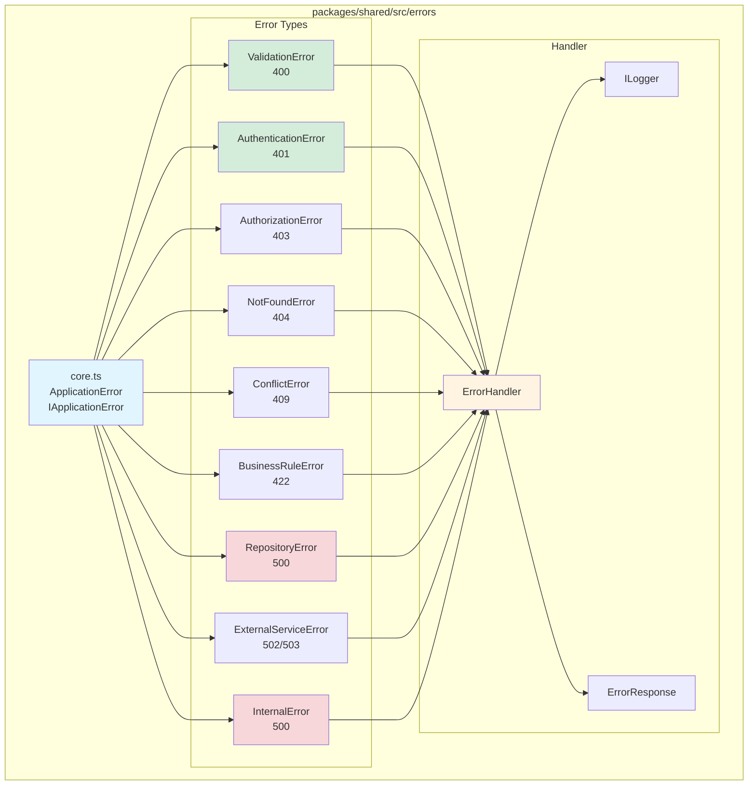
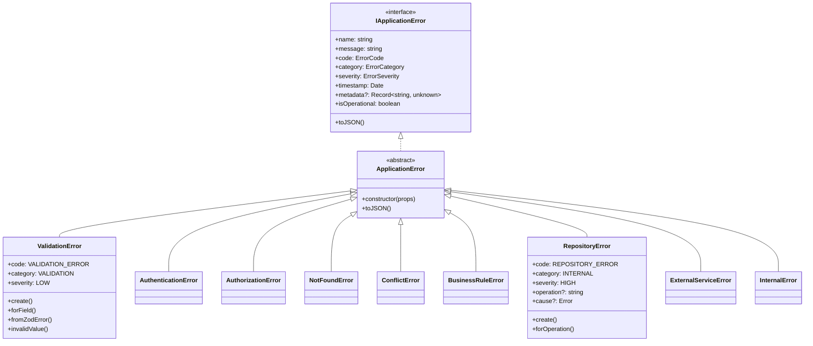
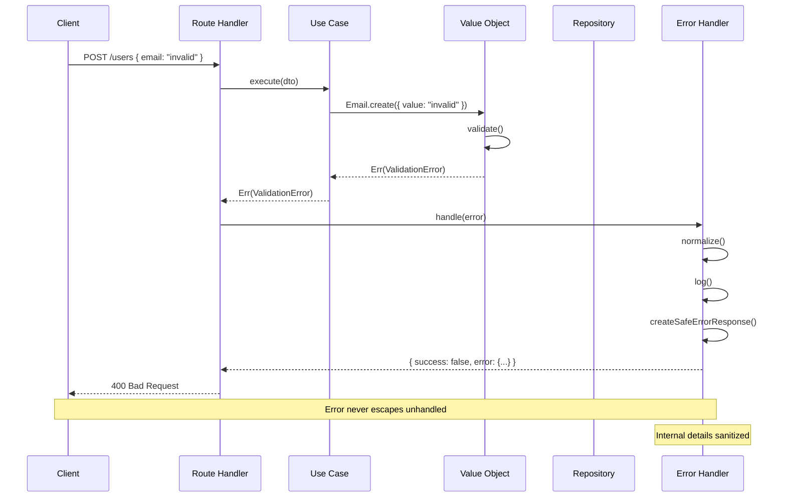
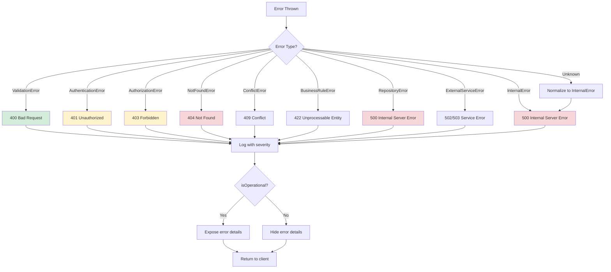

# 🚨 Error Management System

> Centralized, type-safe, and framework-agnostic error handling system for TeamPulse

## 📋 Table of Contents

- [Architecture](#-architecture)
- [Error Types](#-error-types)
- [Usage in Value Objects](#-usage-in-value-objects)
- [Usage in Use Cases](#-usage-in-use-cases)
- [Usage in Repositories](#-usage-in-repositories)
- [Error Handler](#-error-handler)
- [Complete Flow](#-complete-flow)
- [Best Practices](#-best-practices)

## 🏗️ Architecture

The error system is **fully centralized** in `@team-pulse/shared/errors` to provide:
- ✅ Reusability across API and Web
- ✅ Complete type safety
- ✅ Framework-agnostic design
- ✅ Consistency throughout the application



### Error Hierarchy



## 📦 Error Types

### ValidationError (400)
**When to use:** Invalid input data, validation failures

```typescript
import { ValidationError } from '@team-pulse/shared/errors'

// In Value Objects
static create({ value }: { value: string }): Result<Email, ValidationError> {
  if (!value) {
    return Err(ValidationError.forField({
      field: 'email',
      message: 'Email is required'
    }))
  }

  if (!EMAIL_REGEX.test(value)) {
    return Err(ValidationError.invalidValue({
      field: 'email',
      value,
      message: 'Invalid email format'
    }))
  }

  return Ok(new Email(value))
}

// From Zod
const result = schema.safeParse(data)
if (!result.success) {
  throw ValidationError.fromZodError({ error: result.error })
}
```

### AuthenticationError (401)
**When to use:** Invalid credentials, expired tokens

```typescript
import { AuthenticationError } from '@team-pulse/shared/errors'

// Invalid credentials
throw AuthenticationError.invalidCredentials()

// Invalid token
throw AuthenticationError.invalidToken({ reason: 'Token expired' })

// Missing token
throw AuthenticationError.missingToken()
```

### AuthorizationError (403)
**When to use:** Authenticated user lacks permissions

```typescript
import { AuthorizationError } from '@team-pulse/shared/errors'

if (!user.hasRole('ADMIN')) {
  throw AuthorizationError.insufficientPermissions({
    required: 'ADMIN',
    actual: user.role
  })
}
```

### NotFoundError (404)
**When to use:** Resource not found

```typescript
import { NotFoundError } from '@team-pulse/shared/errors'

const user = await repository.findById(id)
if (!user) {
  throw NotFoundError.forResource({
    resource: 'User',
    identifier: id
  })
}
```

### ConflictError (409)
**When to use:** Resource already exists, state conflict

```typescript
import { ConflictError } from '@team-pulse/shared/errors'

const exists = await repository.existsByEmail(email)
if (exists) {
  throw ConflictError.duplicate({
    resource: 'User',
    identifier: email
  })
}
```

### BusinessRuleError (422)
**When to use:** Business rule violation

```typescript
import { BusinessRuleError } from '@team-pulse/shared/errors'

if (team.memberCount >= MAX_MEMBERS) {
  throw BusinessRuleError.create({
    message: 'Team has reached maximum capacity',
    rule: 'MAX_TEAM_MEMBERS',
    metadata: { current: team.memberCount, max: MAX_MEMBERS }
  })
}
```

### RepositoryError (500)
**When to use:** Database failures, persistence issues

```typescript
import { RepositoryError } from '@team-pulse/shared/errors'

try {
  await db.insert(users).values(userData)
} catch (error) {
  throw RepositoryError.forOperation({
    operation: 'insert',
    message: 'Failed to create user',
    cause: error as Error
  })
}
```

### ExternalServiceError (502/503)
**When to use:** External service failures (APIs, third-party)

```typescript
import { ExternalServiceError } from '@team-pulse/shared/errors'

try {
  await stripe.createPayment(data)
} catch (error) {
  throw ExternalServiceError.create({
    message: 'Payment service unavailable',
    service: 'Stripe',
    metadata: { error: error.message }
  })
}
```

### InternalError (500)
**When to use:** Unexpected system errors

```typescript
import { InternalError } from '@team-pulse/shared/errors'

try {
  // Critical operation
} catch (error) {
  throw InternalError.fromError({
    error: error as Error,
    context: 'Critical operation failed'
  })
}
```

## 🎯 Usage in Value Objects

Value Objects use `ValidationError` and return `Result<T, ValidationError>`:

```typescript
import { ValidationError } from '@team-pulse/shared/errors'
import { Ok, Err, type Result } from '@team-pulse/shared/result'

export class Email {
  private constructor(private readonly value: string) {}

  private static validate({ value }: { value: string }): ValidationError | null {
    if (!value || value.trim() === '') {
      return ValidationError.forField({
        field: 'email',
        message: 'Email is required'
      })
    }

    if (value.length > 255) {
      return ValidationError.forField({
        field: 'email',
        message: 'Email is too long'
      })
    }

    const emailRegex = /^[^\s@]+@[^\s@]+\.[^\s@]+$/
    if (!emailRegex.test(value)) {
      return ValidationError.invalidValue({
        field: 'email',
        value,
        message: 'Invalid email format'
      })
    }

    return null
  }

  static create({ value }: { value: string }): Result<Email, ValidationError> {
    const error = Email.validate({ value })
    if (error) return Err(error)

    return Ok(new Email(value.toLowerCase().trim()))
  }

  getValue(): string {
    return this.value
  }
}
```

## 🔄 Usage in Use Cases

Use Cases handle errors explicitly with `Result`:

```typescript
import { ValidationError, ConflictError, RepositoryError } from '@team-pulse/shared/errors'
import { Ok, Err, type Result } from '@team-pulse/shared/result'

export class CreateUserUseCase {
  async execute(dto: CreateUserDTO): Promise<Result<UserResponseDTO, ValidationError | ConflictError | RepositoryError>> {
    // 1. Validate input
    const emailResult = Email.create({ value: dto.email })
    if (!emailResult.ok) {
      return Err(emailResult.error) // ValidationError
    }

    // 2. Check for duplicates
    const exists = await this.userRepository.existsByEmail(emailResult.value)
    if (exists) {
      return Err(ConflictError.duplicate({
        resource: 'User',
        identifier: dto.email
      }))
    }

    // 3. Create user
    const userResult = User.create({
      id: randomUUID(),
      email: emailResult.value,
      name: dto.name,
    })

    if (!userResult.ok) {
      return Err(userResult.error) // ValidationError
    }

    // 4. Persist
    try {
      await this.userRepository.save(userResult.value)
    } catch (error) {
      return Err(RepositoryError.forOperation({
        operation: 'save',
        message: 'Failed to create user',
        cause: error as Error
      }))
    }

    return Ok(UserMapper.toDTO(userResult.value))
  }
}
```

## 💾 Usage in Repositories

Repositories throw `RepositoryError` for persistence failures:

```typescript
import { RepositoryError } from '@team-pulse/shared/errors'

export class DrizzleUserRepository implements IUserRepository {
  async save(user: User): Promise<void> {
    try {
      await this.db.insert(users).values({
        id: user.id.getValue(),
        email: user.email.getValue(),
        name: user.name.getValue(),
      })
    } catch (error) {
      throw RepositoryError.forOperation({
        operation: 'save',
        message: 'Failed to save user',
        cause: error as Error
      })
    }
  }

  async findById(id: UserId): Promise<User | null> {
    try {
      const [row] = await this.db
        .select()
        .from(users)
        .where(eq(users.id, id.getValue()))
        .limit(1)

      if (!row) return null

      return UserMapper.toDomain(row)
    } catch (error) {
      throw RepositoryError.forOperation({
        operation: 'findById',
        message: 'Failed to find user',
        cause: error as Error
      })
    }
  }
}
```

## 🔧 Error Handler

The `ErrorHandler` is framework-agnostic and handles all errors consistently:

```typescript
import { ErrorHandler, ConsoleLogger } from '@team-pulse/shared/errors/handler'

const errorHandler = new ErrorHandler({
  logger: new ConsoleLogger(),
  includeStackTrace: process.env.NODE_ENV === 'development'
})

// Normalizes any error to ApplicationError
const appError = errorHandler.normalize(error)

// Generates safe HTTP response
const response = errorHandler.handle(appError)
// {
//   success: false,
//   error: {
//     code: 'VALIDATION_ERROR',
//     message: 'Invalid email format',
//     timestamp: '2025-11-27T...',
//     metadata: { field: 'email', value: 'invalid' }
//   }
// }
```

## 🌊 Complete Flow



### Decision Flow



## ✨ Best Practices

### ✅ DO

```typescript
// ✅ Use factory methods
const error = ValidationError.forField({ field: 'email', message: 'Required' })

// ✅ Provide useful context
const error = RepositoryError.forOperation({
  operation: 'findById',
  message: 'User not found in database',
  cause: dbError
})

// ✅ Use Result<T, E> in Value Objects and Use Cases
static create({ value }: Props): Result<Email, ValidationError> {
  // ...
}

// ✅ Catch specific errors
try {
  await repository.save(user)
} catch (error) {
  if (error instanceof RepositoryError) {
    // Specific handling
  }
}
```

### ❌ DON'T

```typescript
// ❌ DON'T create errors with new directly
const error = new ValidationError({ message: '...' }) // ❌

// ❌ DON'T use throw for expected errors in Value Objects
static create(value: string): Email {
  if (!value) throw new Error('Invalid') // ❌
  return new Email(value)
}

// ❌ DON'T ignore errors
try {
  await repository.save(user)
} catch (error) {
  console.log(error) // ❌
}

// ❌ DON'T expose internal details in messages
throw new Error('Database connection failed at localhost:5432') // ❌
```

## 🎓 Summary

1. **All errors in `@team-pulse/shared/errors`**
2. **Use factory methods** (`create()`, `forField()`, etc.)
3. **Result<T, E>** for expected errors
4. **throw** only for exceptional errors
5. **ErrorHandler** normalizes and sanitizes automatically
6. **Type-safe** throughout the application

---

**Next Steps:**
- [ ] Error rehydration in frontend
- [ ] Message internationalization
- [ ] Trace IDs for observability
- [ ] Error telemetry
